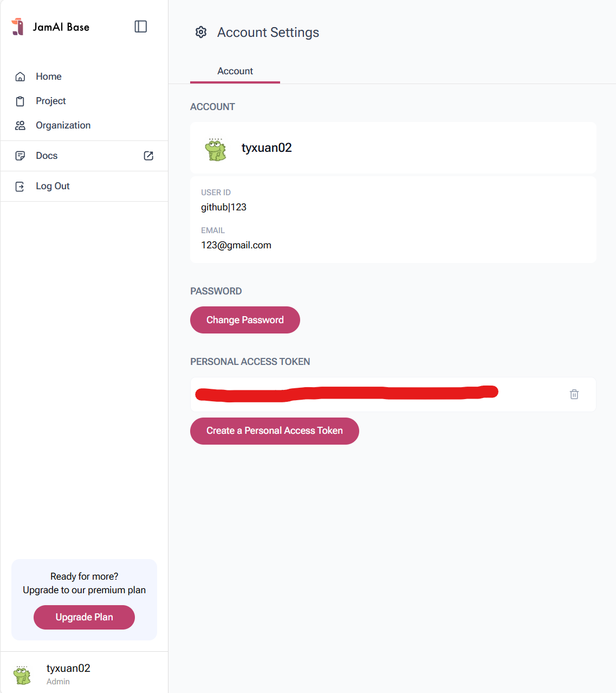

## UM Shuttle Bus Chatbot v2.0

UM Shuttle Bus Chatbot is a simple chatbot designed to provide information about UM shuttle bus schedules, routes and FAQs. By leveraging JamAI Base, an open-source Backend-as-a-Service (BaaS) for managing workflows of large language models (LLMs), the chatbot can respond to different user queries. The chatbot is implemented using Python and Streamlit.

### Run the chatbot locally

1. Download the project to your local machine.

2. Visit the [following link](https://jamai.us.auth0.com/u/login?state=hKFo2SA2MHBBWDBLNkpkdnoybmxFVEZ1X1lzSVlQTEFQNXpQUKFur3VuaXZlcnNhbC1sb2dpbqN0aWTZIEV0ODFmRm1Ua0RUWnhjazQ3Q01WTTdhbktGVzUxaU9xo2NpZNkgNGR5YUhDc3UwcEZ5Zzh0S2Rtc1ZjV0N2eGw1N1JibnI) and create a JamAI Base account.

3. After logging in, create a new project and copy the project ID.


4. Go to the account settings tab by clicking on the profile icon on the bottom left corner of the page. Next, generate an API key and copy it.


5. Go back to the project folder on your local machine and create a .env file. Add the following lines to the .env file and replace YOUR_PROJECT_ID and YOUR_API_KEY with the project ID and API key you copied in step 3 and 4 respectively.:
```
JAMAI_BASE_PROJECT_ID=YOUR_PROJECT_ID
JAMAI_BASE_API_KEY=YOUR_API_KEY
```


6. Install required dependencies: `pip install -r requirements.txt`

7. Run the chatbot: `streamlit run 1_Chatbot.py`